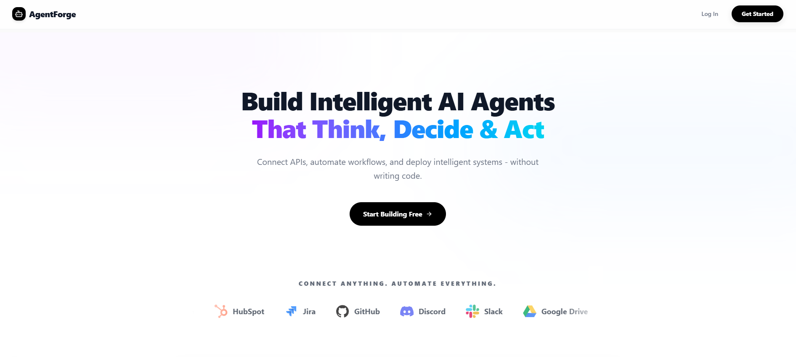
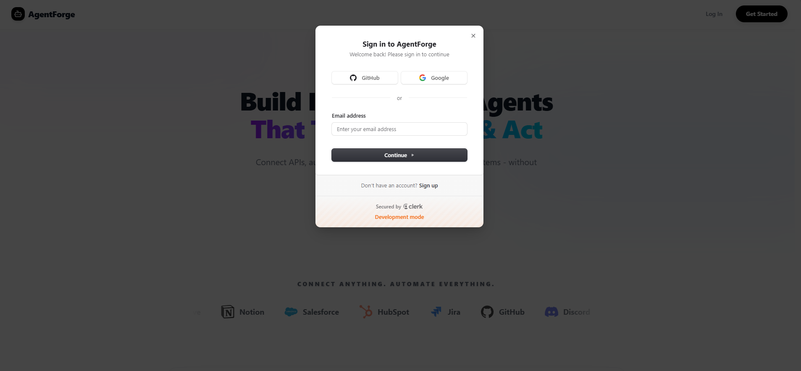
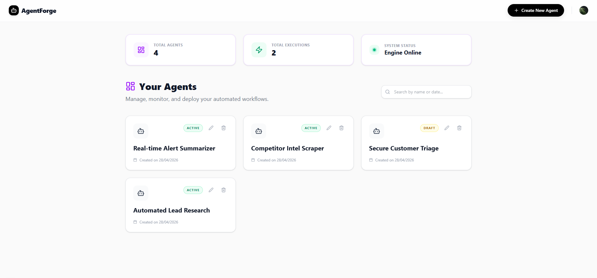
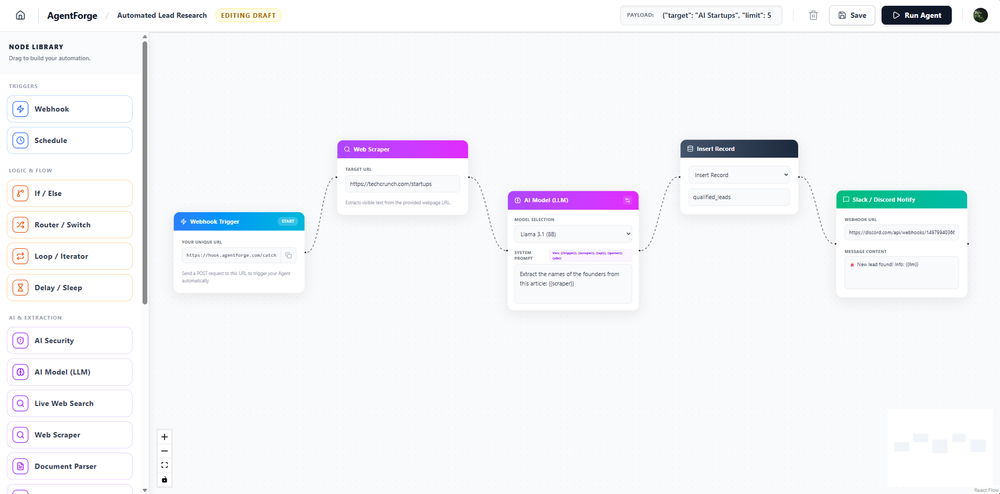
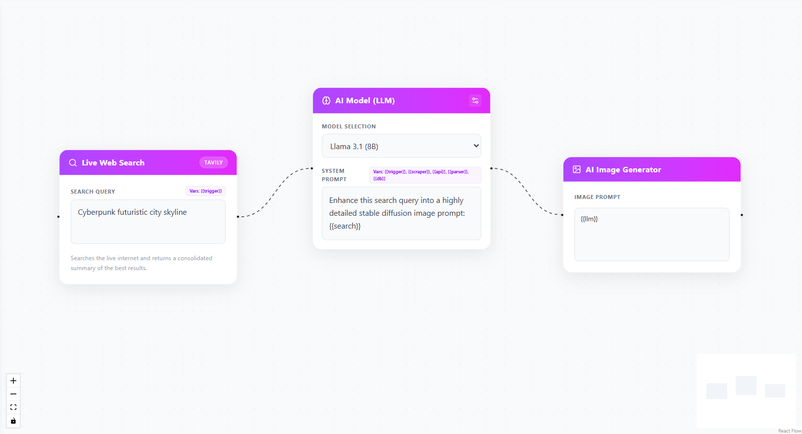
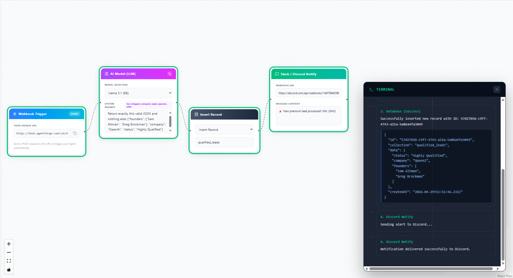
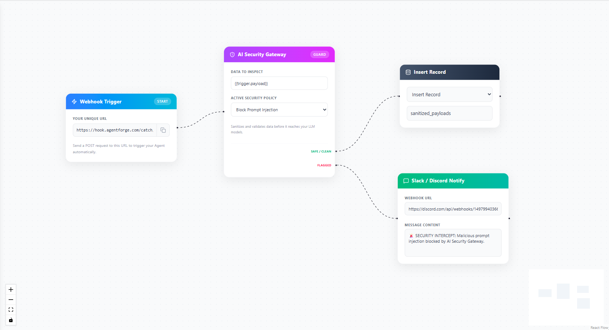

# AgentForge: Visual AI Workflow Automation Engine

[](https://nextjs.org/)
[](https://reactflow.dev/)
[](https://www.prisma.io/)
[](https://clerk.com/)
[](https://tailwindcss.com/)
[](https://opensource.org/licenses/MIT)

Hey! I'm Aman. I built **AgentForge** to democratize the creation of complex AI agents. Writing boilerplate code to connect LLMs, databases, and APIs is repetitive and difficult to maintain. I engineered a visual, node-based execution engine that allows developers to design, test, and deploy intelligent AI workflows entirely through a drag-and-drop canvas.

🌐 **Live Deployment:** 🔗 [Try AgentForge Here](https://agent-forge-jade.vercel.app)

---

## 🎯 Engineering Objective

**The Problem:** Building capable AI agents usually requires complex scripting, managing state between API calls, handling context windows, and building custom routing logic. Visualizing how data flows from a trigger to an LLM and finally to a database is highly abstract and prone to breaking.

**The Solution:** AgentForge acts as a visual IDE for AI. It features a custom-built React Flow canvas where users can visually connect Webhooks, Llama 3.1 AI models, Web Scrapers, Logic Routers, and Databases. The backend parses this visual graph into an executable JSON payload, processing the logic seamlessly and returning real-time execution logs.

---

## 🏗️ System Architecture & Execution Flow

I designed the execution engine to dynamically parse UI nodes into backend logic. When an agent is triggered, the engine steps through the graph, substituting variables and handling external API calls autonomously.

```text
     [Webhook / Schedule] ──(Trigger)──> [AgentForge Execution Engine]
                                                   │
                                                   ▼
                                     [Graph Parsing & Validation]
                                     ├─ 1. Variable Injection ({{trigger}})
                                     └─ 2. Node Execution Routing
                                                   │
              ┌────────────────────────────────────┴────────────────────────────────────┐
              ▼                                    ▼                                    ▼
       [AI & Scrapers]                      [Logic & Flow]                     [Actions & Storage]
       (Groq / Tavily)                     (If/Else, Loops)                   (Postgres / Discord)
              │                                    │                                    │
              └────────────────────────────────────┼────────────────────────────────────┘
                                                   ▼
                                    [Live Terminal Execution Logs]
                                     (Real-time Visual Feedback)
```

---

## 🖥️ Platform Features & UI

### 1. The Landing Interface
A clean, modern interface featuring interactive elements to introduce the platform's visual automation capabilities.



### 2. Secure Authentication
Enterprise-grade authentication powered by Clerk, ensuring user workspaces and API configurations remain completely private.



### 3. Agent Management Dashboard
The central command center. Track global executions, monitor engine status, and manage your active workflow drafts.



### 4. Visual Node Canvas
The core product workspace. A highly interactive drag-and-drop canvas with custom-designed nodes categorized by Triggers, Logic, AI, Actions, and Storage.



### 5. Dynamic Variable Injection
Advanced node configuration allowing users to pass data seamlessly across the graph using intuitive mustache syntax. For example, capturing real-time data with a Live Web Search node, passing those results into an AI Model using `{{search}}`, and routing the final prompt to an AI Image Generator using `{{llm}}`.



### 6. Real-Time Execution Terminal
A custom-built, auto-scrolling terminal that provides step-by-step logs of the backend execution engine, featuring CSS animations that highlight nodes as they successfully process payload data in real-time.



### 7. AI Security Gateway
An integrated middleware node that actively inspects incoming data for Prompt Injections, PII leaks, and Toxicity before it ever reaches the LLM. It processes dynamic variables like `{{trigger.payload}}` and enables secure dual-path routing (Safe/Clean vs. Flagged) to handle malicious inputs autonomously.



---

## 📁 Codebase Architecture

```text
agent-forge/
├── app/
│   ├── api/                   # Next.js API Routes (Agents, Execution Engine)
│   ├── builder/               # The React Flow Canvas workspace
│   ├── privacy/               # Legal & Privacy pages
│   ├── terms/                 # Terms of Service
│   ├── globals.css            # Tailwind & Custom Animation CSS
│   ├── layout.tsx             # Root layout with Clerk Provider
│   └── page.tsx               # Hybrid Landing Page & Dashboard
├── assets/                    # Screenshots for README documentation
├── components/
│   ├── nodes/                 # Custom React Flow Node Components
│   │   ├── AISecurityNode.tsx
│   │   ├── LLMNode.tsx
│   │   ├── WebhookNode.tsx
│   │   └── ...
│   └── Sidebar.tsx            # Draggable node library
├── prisma/
│   ├── migrations/            # Database version control
│   └── schema.prisma          # PostgreSQL Schema (Users, Agents, Logs)
├── .env.example               # Template for required API keys
├── docker-compose.yml         # Local Postgres & Redis setup
├── proxy.ts                   # Clerk Auth edge routing protection
├── package.json               # Project dependencies
└── README.md                  # Project documentation
```

---

## 🛠️ Technical Decisions & Trade-offs

* **React Flow JSON State vs. Deep Relational Tables:** I chose to store the visual canvas state (nodes and edges) as a serialized `JSONB` block in PostgreSQL rather than breaking them down into individual relational rows. *Tradeoff:* This prevents complex cross-node SQL queries, but allows for lightning-fast reads/writes, trivial versioning, and eliminates complex table joins for UI rendering.
* **Serverless Next.js API vs. Long-Running Backend:** The execution engine runs on Next.js Edge/Serverless API routes. *Tradeoff:* This makes deployment to Vercel incredibly easy and scales infinitely from day one. However, serverless architectures have timeout limits (10s - 60s), meaning extremely long-running AI workflows would eventually require transitioning to a background job architecture like BullMQ/Redis. *(This frames it as a future scaling option rather than a current requirement).*
* **Clerk Auth vs. Custom JWT:** Delegated authentication to Clerk middleware. *Tradeoff:* Introduces third-party dependency, but instantly grants secure multi-session management and enterprise-grade security without reinventing the wheel.

---

## 🚀 Local Development

### 1. Clone & Setup

```bash
git clone https://github.com/iamanpathak/agent-forge.git
cd agent-forge

# Install dependencies
npm install
```

### 2. Environment Variables
Create a `.env` file in the root directory and copy the contents from `.env.example`. You will need to provision keys for:
* Clerk (Authentication)
* Groq (LLM Engine)
* Tavily (Live Web Search)
* Resend (Email Node)

### 3. Database Setup
Start the local PostgreSQL database using Docker, then push the Prisma schema:

```bash
docker-compose up -d
npx prisma db push
```

### 4. Launch the Application
Start the Next.js development server:

```bash
npm run dev
```
Navigate to `http://localhost:3000` to access AgentForge locally.

---

## ☁️ Production Deployment

AgentForge is fully optimized for serverless edge deployment. The current live production build is hosted on Vercel. 

**🔗 [View Live Application](https://agent-forge-jade.vercel.app)**

To deploy your own instance:
1. Import the repository into Vercel.
2. Add your `.env` variables in the Vercel project settings.
3. Provision a cloud PostgreSQL database (e.g., Neon or Supabase) and update your `DATABASE_URL`.
4. Deploy!

---

## 📄 License

This project is licensed under the **MIT License**. See the [LICENSE](LICENSE) file for details.

<p align="center">
  Made with ❤️ by <a href="https://github.com/iamanpathak">Aman Pathak</a>
</p>